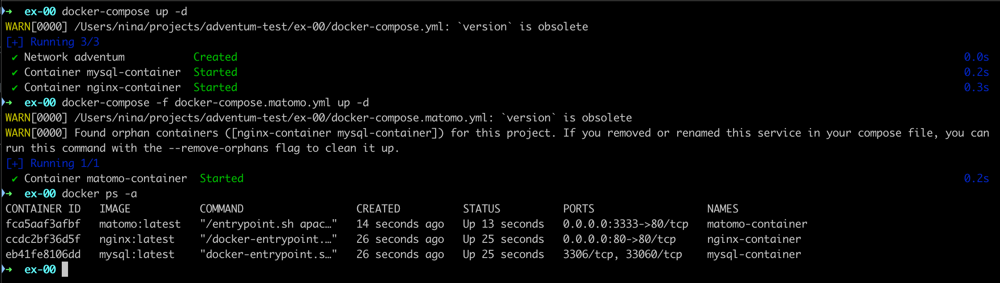

Изначально мы поднимаем 2 контейнера с MySQL и Nginx в 1 сети.

```docker-compose up -d```

После мы подключаем к их сети 3 контейнер с Matomo

```docker-compose -f docker-compose.matomo.yml up -d```

Самое важное создать общую сеть и забиндить порты.

