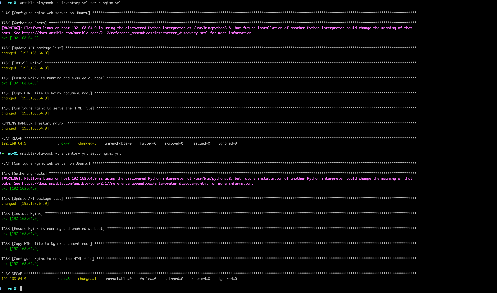

В самом начале поднимаем виртуалку куда мы будем подключаться для тестирования playbook'а

После нужно командой `ssh-copy-id <path> <login>@<ip>` прокинуть публичный ключ на виртуалку для подключения без пароля.

Все данные для подключения пишем в файл `inventory.yml`

Для тестирования подключения к машине используем: `ansible all -i inventory.yml -m ping`
Для полноценноского запуска: `ansible-playbook -i inventory.yml playbook.yml`

На скринщоте видно, что при повторном запуске на 1 виртуалтьной машине Ansible не меняет состояние, а проверяет соответсвует ли оно скрипту.

