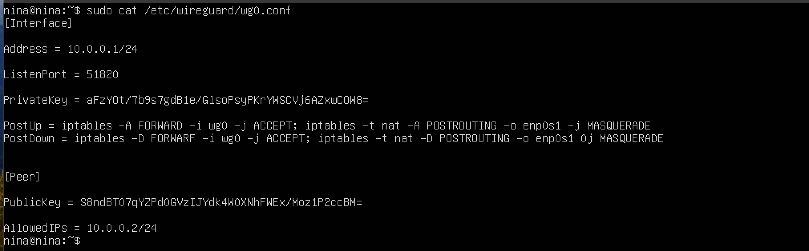
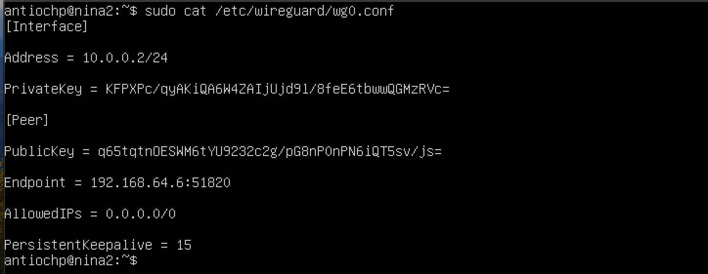
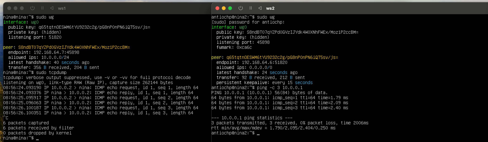

Первым делом устанавливаем wireguard - `sudo apt install wireguard`

Генерируем публичный и приватный ключ сервера `wg genkey | tee /etc/wireguard/server_privateю.key | wg pubkey | tee /etc/wireguard/server_public.key`

Создаем конфиг для сервера, по итогу у меня он выглядит так:

Производим настройку IP Forwarding'а

`sudo vim /etc/sysctl.conf` и расскоментируем строчку `net.ipv4.ip_forward=1`

Проверяем что изменения валидны: `sysctl -p`

Открываем порт на прием пакетов `sufo ufw allow 51820/udp` и `sudo ufw enable`

- Включаем сервис `systemctl start wg-quick@wg0.service`

- Автоазапуск: `systemctl enable wg-quick@wg0.service`

- Проверка работоспособности `systemctl status wg-quick@wg0.service`

Переходим к настройке клиента, большая часть тут аналогичная.

Устанавливаем wireguard, делаем ключи и создаем конфиг в `/etc/wireguard/wg0.conf/`

### Важно добавить публичный ключ клиента в конфиг сервера и перезагрузить сервер

После, так же включаем автозапуск на wireguard'а на стороне клиента `sudo systemctl enable wg-quick@wg0`

Проверить запущен ли Wireguard, можно командой `sudo wg`.

Пробуем пропинговать `ping -c 3 10.0.0.1`

